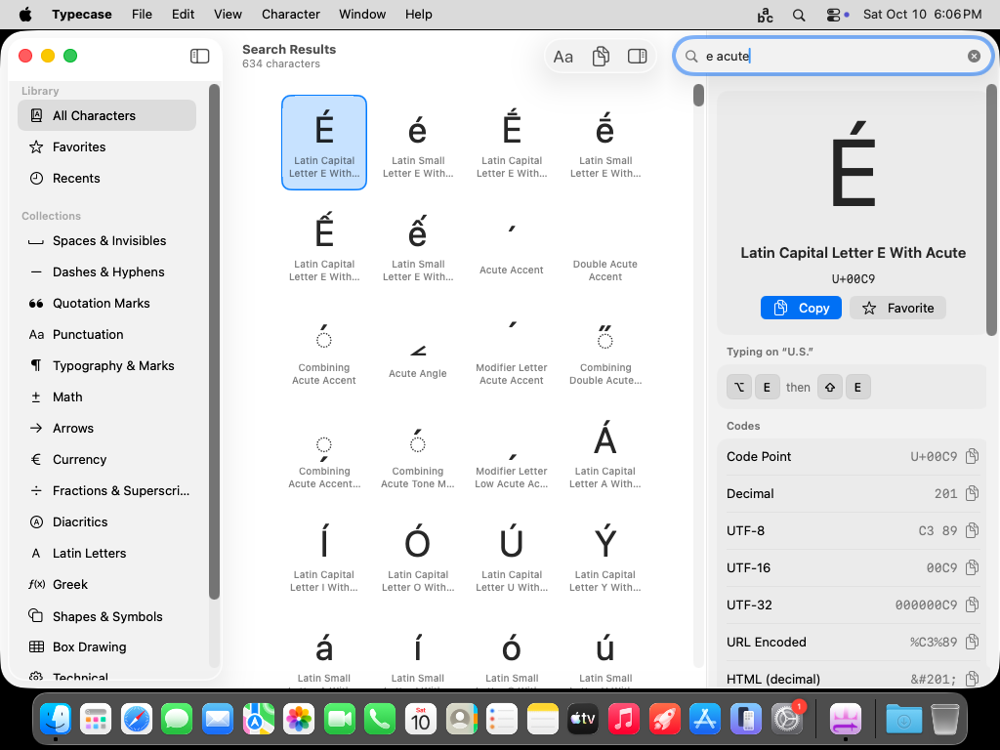
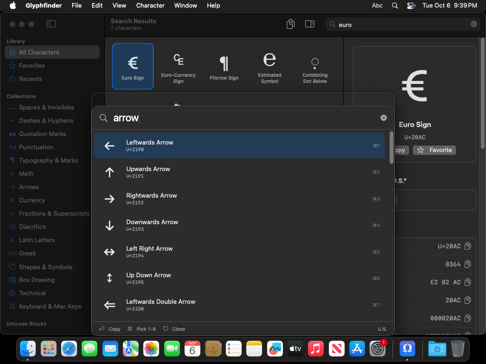
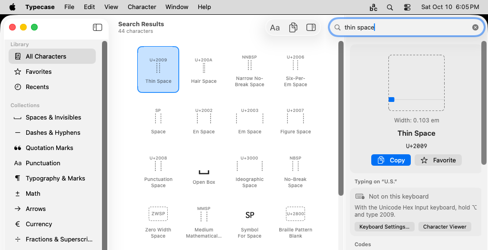
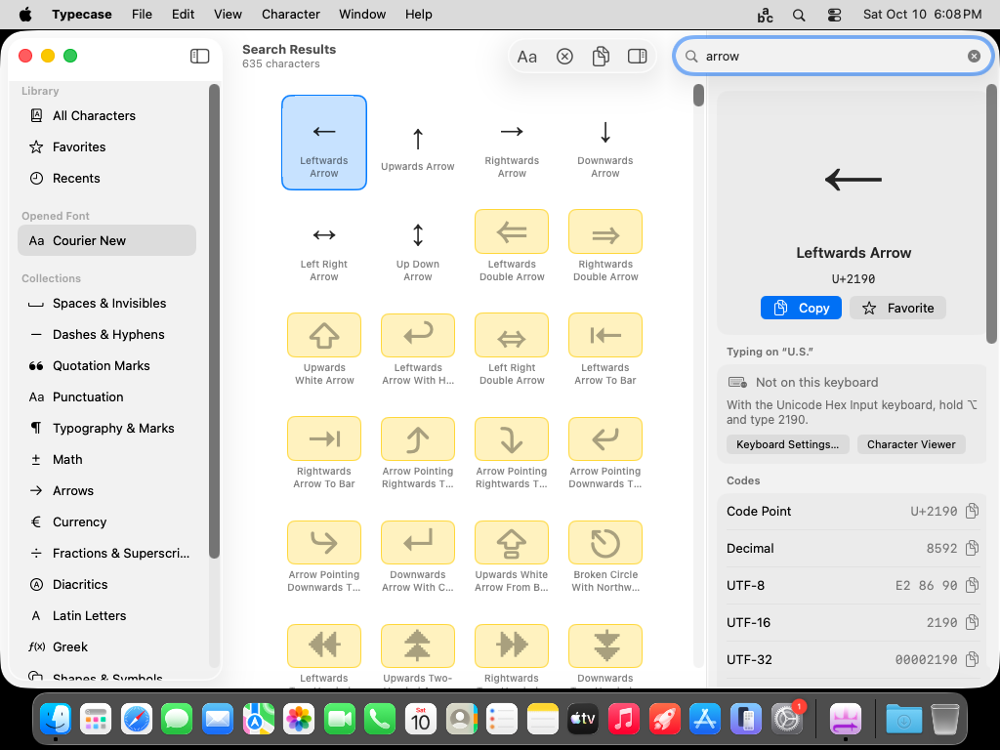

# Typecase

A native macOS utility for finding Unicode characters by describing them: *thin space*, *curly apostrophe*,
*backwards question mark*, `U+2009`, `&thinsp;`, or a character you pasted. It covers everything the system emoji
viewer does not (all the spaces, dashes, quotes, invisibles, combining marks, math, arrows …) and **leaves emoji out**.

For each character it shows:

- the **code point**, decimal, UTF-8 / UTF-16 / UTF-32, HTML (named, decimal, hex), CSS, Swift, JavaScript, Python,
  JSON and URL forms, plus the legacy **ASCII / Mac OS Roman / Windows-1252 (Alt code)** numbers;
- **how to type it with the keyboard layout you are using right now**, drawn as key caps (⌥ E, then E), including dead
  keys, and a fallback hint (Unicode Hex Input, Character Viewer) when the layout cannot type it;
- **related and alternate characters** (look-alikes, composed variants, cross references) and **font alternates**
  (stylistic sets and other OpenType/AAT variants) in a font you choose;
- for spaces (thin, hair, NBSP, em …) the grid draws **two dotted lines whose distance is the space's width**, and the inspector an **em-width ruler**, so you can see how they differ; other invisibles (ZWJ, joiners …) get a dashed box;
- which installed fonts contain the glyph.



| Quick Lookup (dark mode) | Invisible characters with em-width ruler |
|---|---|
|  |  |



*(Screenshots are taken from the real app on a macOS runner by the UI smoke test, at 1024×768.)*

## Using it

| | |
|---|---|
| **Main window** | Sidebar (Library, Collections, Unicode Blocks), a character grid, and an inspector. Search field in the toolbar. |
| **Quick Lookup** | Floating window opened with **⌃⌥Space** (changeable in Settings) or ⌥⌘L. Type, ↑/↓, **⏎** copies and returns to your app, **⌘⏎** shows the character in the main window; ⌘1–⌘9 pick a result; Esc closes. |
| **Menu bar item** | A click opens Quick Lookup. A right click (or a click while Quick Lookup is showing) opens the menu with recent characters, favorites, Settings and Quit. It can be hidden; the Dock icon can be hidden too. |
| **Open Font…** | ⌘O, the toolbar, or drop a `.ttf` / `.otf` / `.ttc` file on the window. The font is read into memory (never installed). The sidebar gets an *Opened Font* entry listing every visible character the font has, and all glyphs, the inspector and Quick Lookup are drawn with it. Characters the font lacks use the normal font at reduced opacity on a yellow-tinted box. Close it with *File ▸ Close Font* or the toolbar button. |
| **Copy** | ⌘⏎ copies the selected character, ⇧⌘C its code point, ⌥⌘C its HTML entity, ⌘D toggles favorite. Double-click or drag a character to use it. |
| **Shortcuts app** | "Find Character" and "Copy Character" actions (App Intents). |

Search understands names (`left double quote`), everyday words (`umlaut`, `nbsp`, `tick`), other languages
(`gedachtestreepje`, `Geviertstrich`, `pijl rechts`), typos (`ellpsis`), code points in many notations, and pasted characters.

## Building

Requirements: macOS 15 or later, Xcode 16 or later.

```sh
open Typecase.xcodeproj
```

Pick the **Typecase** scheme and press ⌘R. The *Debug* configuration is signed "to run locally", so no Apple
Developer account is needed. To keep the app, use **Product ▸ Show Build Folder in Finder** and copy
`Debug/Typecase.app` to `/Applications`, or set your Team once under *Signing & Capabilities* and use
**Product ▸ Archive ▸ Distribute App ▸ Copy App**.

To launch at login, open the app's Settings (⌘,) ▸ General.

### Publishing

| Target | Scheme / configuration | Notes |
|---|---|---|
| **Mac App Store** | `Typecase`, *Release* | Fully sandboxed (`Typecase.entitlements`), no network, no extra permissions. Includes a privacy manifest. Copies to the clipboard; it does not paste into other apps (the sandbox forbids that). |
| **Direct download** | `Typecase (Direct)`, *Release-Direct* | Not sandboxed, hardened runtime, notarize it. Adds the "Paste into the previous app" option (needs the Accessibility permission). Compiled with `DIRECT_DISTRIBUTION`. |

Before submitting, change **PRODUCT_BUNDLE_IDENTIFIER** (`com.milanelsen.typecase` is a placeholder), set your
**Team**, and review the copyright line in `Typecase/Info.plist`. The product name is `Typecase`; rename it
in `Tools/generate_xcodeproj.rb` (`APP_NAME`) and regenerate if you prefer another.

## Project layout

```
Typecase.xcodeproj         generated by Tools/generate_xcodeproj.rb (checked in)
Typecase/                  the SwiftUI app
  App/                        scenes, commands, model, App Intents, settings keys
  Views/                      main window, grid, inspector, Quick Lookup, menu bar, Settings
  Services/                   global hotkey, keyboard service, pasteboard/insert
  Resources/                  asset catalog, Localizable.xcstrings (en, nl, de), privacy manifest
Core/                         UI-free logic: database, search, code formats, keyboard mapper, CoreText helpers
  Sources/GlyphCore/            compiled straight into the app target, and also a Swift package
  Tests/GlyphCoreTests/         39 tests (search quality, data invariants, formats, dead-key mapping)
Data/characters.json          bundled database, generated, 32k characters (Unicode 16, no emoji, no CJK ideographs)
Tools/build-db/               builds Data/characters.json from the Unicode Character Database + CLDR
Tools/make-icon/              renders the app icon
Tools/make-strings/           generates Localizable.xcstrings
PLAN.md                       design plan
```

SwiftUI is used wherever it can do the job. AppKit/Carbon appear only where SwiftUI has no API: the global hotkey
(`RegisterEventHotKey`), reading the active keyboard layout (`UCKeyTranslate`), the pasteboard, the Dock/menu-bar
activation policy, and the Dock-click handler. Each is a few lines in `Services/` or `AppDelegate.swift`.

## Tests and tooling

```sh
cd Core && swift test                                   # works on macOS and Linux
python3 Tools/build-db/build_db.py --cache /tmp/ucd     # regenerate Data/characters.json
python3 Tools/make-strings/make_strings.py              # regenerate the string catalog
python3 Tools/make-icon/make_icon.py                    # regenerate the icon (needs Pillow)
ruby Tools/generate_xcodeproj.rb                        # regenerate the Xcode project (gem install xcodeproj)
```

Search quality lives mostly in `Tools/build-db/synonyms.txt` (everyday names Unicode does not use) and is guarded by
`Core/Tests/GlyphCoreTests/SearchTests.swift`. Add a synonym and a test together.

## What has been verified

Continuous integration (`.github/workflows/`) runs on every push:

- **Core tests**: 39 tests on Linux (Swift 6.1) and on macOS.
- **Builds**: Debug, Release and Release-Direct with Xcode 16.4 / macOS 15 SDK, with no compiler errors or warnings.
- **UI smoke test** (run manually: *Actions ▸ UI smoke test*): launches the built, sandboxed app on macOS 15, drives it with
  keystrokes and checks the result. It covers launch (no crash), search in the main window, Copy, the global shortcut,
  Quick Lookup typing and copy (clipboard checked byte for byte), the dead-key instructions for É (⌥E, ⇧E) and € (⌥⇧2) on
  the US layout, the Settings window, the menu bar menu and dark mode. Screenshots and logs are published to the
  `ci-artifacts` branch (safe to delete).

Not verified: signing/notarization and App Store submission (they need your Apple Developer account), launch at login, the
Accessibility-based paste of the Direct build, and keyboard layouts other than US (the mapper is covered by unit tests with a
fake dead-key layout, and reads the real layout through `UCKeyTranslate`).

## Known limitations

- The global shortcut is picked from a short list rather than recorded freely (a free-form recorder needs AppKit).
- With *Launch at login* enabled the main window also opens at login.
- CJK ideographs, Hangul syllables and other algorithmically named ranges are not included: they have no names to search.
- Search is lexical (names, aliases, CLDR keywords in en/nl/de/fr/es, curated synonyms) with typo tolerance. There is no
  embedding search yet.
